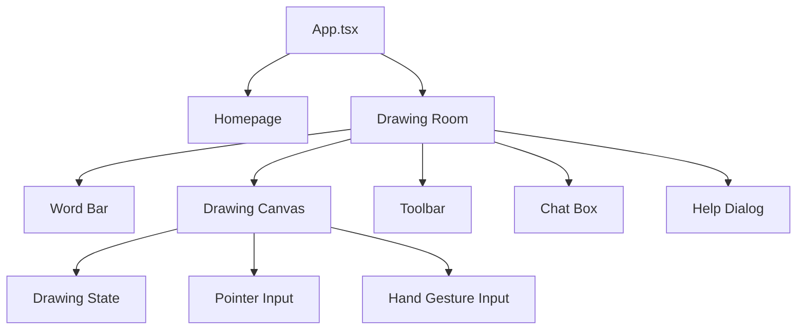

# Moodle

**Moodle** is a pixel-art drawing game website built with React and Vite. Players enter a drawing room, sketch the mystery word, and use the chat box to guess as drawings appear. The app supports mouse, touch, and hand gesture drawing for a more interactive canvas experience.

## Demo

Run the project locally, then open the local Vite URL.

```bash
npm run dev
```

```text
http://127.0.0.1:5173/
```

## Project Structure



```text
src/
  components/     Drawing canvas, cursor, toolbar, and UI panels
  hooks/          Drawing state, pointer input, and hand tracking logic
  utils/          Gesture detection, coordinate mapping, and stroke rendering
  types/          Shared drawing types
  App.tsx         Main page flow and layout
  App.css         Pixel-art UI styling
```

## Frontend

| Area | Purpose |
| --- | --- |
| Homepage | Introduces Moodle and opens the drawing room |
| Drawing room | Main game screen with the canvas, word bar, player panel, and chat |
| Canvas | Supports mouse, touch, and hand-based drawing |
| Help dialog | Shows the game instructions from the word bar |

## Special Features

- Pixel-art themed interface
- Large responsive drawing canvas
- Bold readable word bar
- Mouse and touch drawing
- Hand gesture drawing with MediaPipe
- Chat box for guesses
- Help dialog with instructions

## How It Works

1. The homepage opens the drawing room when the player starts.
2. The word bar shows the current mystery word as letter boxes.
3. Pointer input and hand gestures both send drawing points to the canvas.
4. The drawing engine stores each stroke with its color, size, and tool mode.
5. The canvas redraws saved strokes whenever the drawing state changes.

## Tech Stack

| Layer | Tools |
| --- | --- |
| Frontend | React, TypeScript |
| Build tool | Vite |
| Drawing | HTML Canvas |
| Hand tracking | MediaPipe Tasks Vision |
| Styling | CSS |
