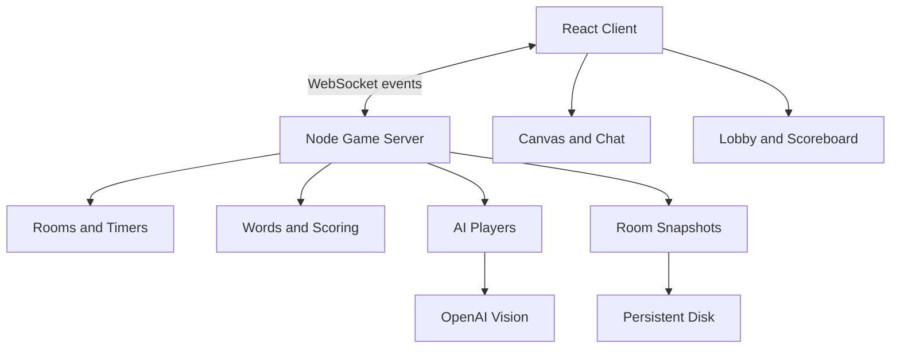

# Moodle

**Moodle** is a real-time pixel-art drawing and guessing game. Players create private or public rooms, draw mystery words, chat, score points, or compete against server-controlled AI players. It supports mouse, touch, hand gestures, spectators, reconnects, and mobile screens without requiring an account.

## Demo

Run the API and frontend in separate terminals.

```bash
npm run dev:api
npm run dev
```

```text
http://127.0.0.1:5173/
```

## Project Structure



```text
src/
  components/     Canvas, cursor, toolbar, and interface panels
  hooks/          Drawing, pointer, gesture, and hand-tracking logic
  utils/          Detection, coordinate mapping, and stroke rendering
  App.tsx         Homepage, lobby, game, chat, and real-time room client
  App.css         Responsive pixel-art interface
server/
  index.js        HTTP, WebSocket, rooms, AI, timers, and persistence
  index.test.js   Protocol, validation, and sanitization tests
```

## Frontend

| Area | Purpose |
| --- | --- |
| Homepage | Creates, joins, watches, or browses rooms |
| Lobby | Configures rounds, timer, words, AI, and room visibility |
| Drawing room | Shows the canvas, hints, timer, players, scores, and chat |
| Canvas | Supports mouse, touch, and hand-based drawing |

## Special Features

- Real-time private and public rooms
- Server-controlled words, timer, guesses, and scores
- AI guessing and gradual AI drawing
- Spectator links and reconnect recovery
- Progressive word hints and drawing replay
- Chat filtering, rate limits, reports, and vote-kick

## How It Works

1. A player creates or joins a room through the homepage.
2. The server chooses the drawer, offers three words, and controls the timer.
3. The drawer sends validated stroke events through a WebSocket connection.
4. Other players see the strokes immediately and submit guesses through chat.
5. The server awards points, advances rounds, and stores room and game history.

## Tech Stack

| Layer | Tools |
| --- | --- |
| Frontend | React, TypeScript, Vite |
| Drawing | HTML Canvas |
| Hand tracking | MediaPipe Tasks Vision |
| Server | Node.js HTTP and WebSockets |
| AI | OpenAI Responses API |
| Persistence | Atomic JSON snapshots |
| Testing | Node test runner, ESLint |
| Deployment | Docker, Render blueprint |
| Styling | CSS |
